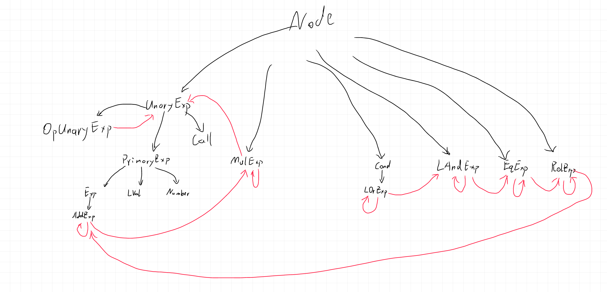

# AST的一些说明
## 常量初始化
原始文法：
$ConstInitVal → ConstExp | '\{' [ ConstInitVal \{ ',' ConstInitVal \} ] '\}'$

在AST中将$ConstInitVal$按照“|”的两边分成`ASTConstInitSingle`和`ASTConstInitList`两种结点，均继承自`ASTConstInitVal`，分别为单个值的初始化和初始化列表。

变量初始化与此类似。

## 表达式部分
表达式部分的继承与包含关系：
对于一个$A\rightarrow B$，黑色箭头表示B继承自A，红色剪头表示A中包含B。

关于UnaryExp:

$$UnaryExp → PrimaryExp | Ident '(' [FuncRParams] ')' | UnaryOp\ UnaryExp$$

AST中的OpUnaryExp即为文法中的$UnaryOp\ UnaryExp$

另外，Cond不支持使用小括号改变运算顺序，即不允许类似`(A || B) && C`的表达式。